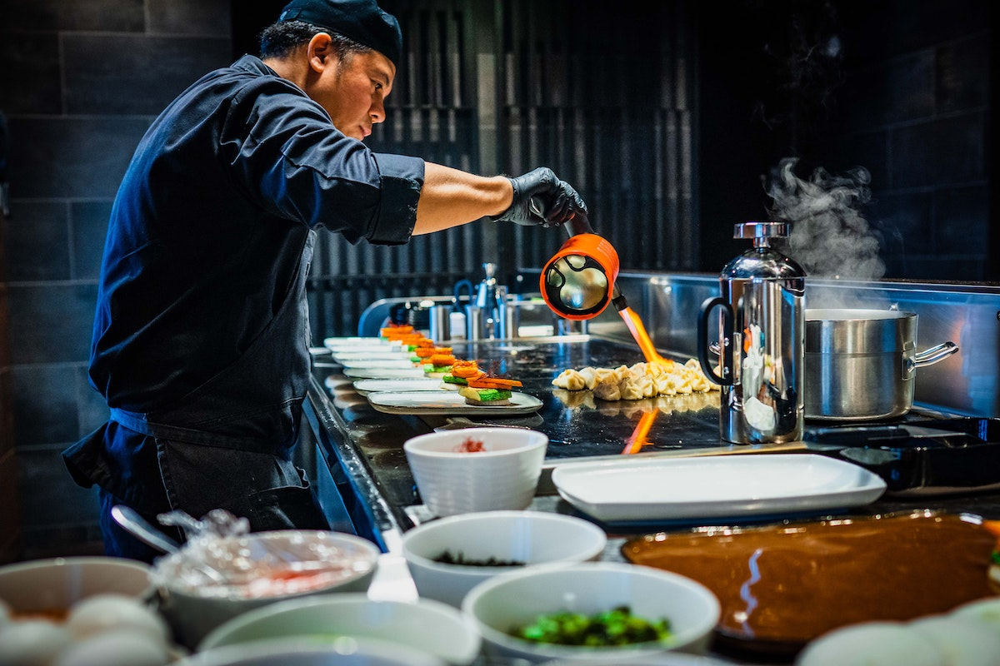

```{r setup, include=FALSE}
usethis::use_git_ignore(c("*.csv", "*.rds"))
options(htmltools.dir.version = FALSE)

library(knitr)
library(tidyverse)
library(xaringan)
library(fontawesome)
```

class: inverse, center, middle

# `r fa("fas fa-images", fill = "#fff")`

**View the slides:** 

[bretsw.com/eme6665-ss23-module4](https://bretsw.com/eme6665-ss23-module4)

---

class: inverse, center, middle

# `r fa("comments", fill = "#fff")` <br><br> Module 3 Discussion <br> Themes

---

# `r fa("comments", fill = "#fff")` Digging In

```{r, out.width = "600px", echo = FALSE, fig.align = "center"}
include_graphics("img/digging.jpg")
```

--

- Going deeper on your topics

--

- Looking in slightly different place, digging again

---

# `r fa("comments", fill = "#fff")` Digging Around

```{r, out.width = "600px", echo = FALSE, fig.align = "center"}
include_graphics("img/shells.jpg")
```

--

- Need to dig a lot

--

- A lot more than the 10 articles you'll identify in Modules 3 & 4

---

# `r fa("comments", fill = "#fff")` Digging Around

```{r, out.width = "600px", echo = FALSE, fig.align = "center"}
include_graphics("img/shells.jpg")
```

- No firm number... maybe more than **30 references**? 

--

- Maybe **15-20 pages** for all of Chapter One (Introduction, Literature Review, Framework, Purpose, and Research Questions)

---

# `r fa("comments", fill = "#fff")` Digging Around

```{r, out.width = "600px", echo = FALSE, fig.align = "center"}
include_graphics("img/shells.jpg")
```

- I had **96** references in my final dissertation

--

- My Chapter One was **17** pages

---

class: inverse, center, middle

# `r fa("fas fa-comments", fill = "#fff")` <br><br> Module 3 Practice:<br>Topic Reflection

---

# `r fa("fas fa-comments", fill = "#fff")` Topic Reflection

```{r, out.width = "600px", echo = FALSE, fig.align = "center"}
include_graphics("img/interview.jpg")
```

--

1. Partner up

--

2. Describe your process of searching the literature

--

3. Reflect on the new insights on your topic from reading this past week

---

class: inverse, center, middle

# `r fa("fas fa-book-open", fill = "#fff")` <br><br> Module 4:<br>Systematic Not Automatic

---

# `r fa("fas fa-book-open", fill = "#fff")` Types of Reviews

### Reading 4.2 Sutton et al. (2019)

--

- Narrative review

--

- Systematic review

--

- Meta-analysis

--

- Umbrella review

--

- Critical review

---

# `r fa("fas fa-book-open", fill = "#fff")` Systematic Reviews

### System ~ Gears?

```{r, out.width = "720px", echo = FALSE, fig.align = "center"}
include_graphics("img/4-gears.jpg")
```

---

# `r fa("fas fa-book-open", fill = "#fff")` Systematic Reviews

### System ~ Mise En Place?

```{r, out.width = "720px", echo = FALSE, fig.align = "center"}
include_graphics("img/4-mise-en-place.jpg")
```

---

# `r fa("fas fa-book-open", fill = "#fff")` Systematic Reviews

### System ~ Preparation Process

```{r, out.width = "720px", echo = FALSE, fig.align = "center"}

```

---

# `r fa("fas fa-book-open", fill = "#fff")` Systematic Reviews

### System ~ Preparation Process: PRISMA standards

```{r, out.width = "720px", echo = FALSE, fig.align = "center"}
include_graphics("img/4-PRISMA-flow-chart.jpg")
```

---

# `r fa("fas fa-book-open", fill = "#fff")` Systematic Reviews

### System ~ Preparation Process: PRISMA Example

```{r, out.width = "480px", echo = FALSE, fig.align = "center"}
include_graphics("img/4-articles-intersections.png")
```

---

# `r fa("fas fa-book-open", fill = "#fff")` Systematic Reviews

### Reading 4.4 Choose-Your-Own-Adventure

```{r, out.width = "100%", echo = FALSE, fig.align = "center"}
include_graphics("img/3-cyoa-books.jpg")
```

---

# `r fa("fas fa-book-open", fill = "#fff")` Systematic Reviews

### Reading 4.4 Choose-Your-Own-Adventure

```{r, out.width = "600px", echo = FALSE, fig.align = "center"}

```

--

- Pick a **systematic literature review** relevant to your research topic

--

- Read **5 articles** cited in the review article

---

class: inverse, center, middle

# `r fa("fas fa-binoculars", fill = "#fff")` <br><br> Looking ahead

---

# `r fa("fas fa-calendar-day", fill = "#fff")` Semester schedule

- Module 1: Threads of Chapter One

- Module 2: Do You Trust Me?

- Module 3: A Handbook's Tale

- **Module 4: Systematic Not Automatic**

- Module 5: Synthesis Over Summary

- Module 6: Elements of Style (for Academic Writing)

- Module 7: Weaving Together Chapter One

---

# `r fa("fas fa-calendar-day", fill = "#fff")` Assignment: Analytic Memo

--

1. Pick **1** systematic literature review or meta-analysis article

--

2. Read **5** articles cited in the review article

--

3. Reflect on how these five studies help you view your dissertation research topic in a new way

--

  - New frameworks, new links between topics, new methods
  
--

4. Synthesize your thoughts and compose a **brief, focused memo** detailing these reflections (**400-600 words**)

--

  - Brief describe the systematic literature review

--

  - Include a 1-2 sentence summary of each article

--

  - Detail new insights gleaned from each article

--

5. Email your Analytic Memo to your dissertation chair

--

<hr>

### Once again, your main objective is **synthesis**!

---

class: inverse, center, middle

# `r fa("fas fa-pen", fill = "#fff")` Drawing the Map

<div class="padlet-embed" style="border:1px solid rgba(0,0,0,0.1);border-radius:2px;box-sizing:border-box;overflow:hidden;position:relative;width:100%;background:#F4F4F4"><p style="padding:0;margin:0"><iframe src="https://fsu.padlet.org/embed/jbwz0hokd7llz8bf" frameborder="0" allow="camera;microphone;geolocation" style="width:100%;height:480px;display:block;padding:0;margin:0"></iframe></p><div style="display:flex;align-items:center;justify-content:end;margin:0;height:28px"><a href="https://padlet.com?ref=embed" style="display:block;flex-grow:0;margin:0;border:none;padding:0;text-decoration:none" target="_blank"><div style="display:flex;align-items:center;"></div></a></div></div>

<div class="caption">
<p><a href="https://rgbstudios.org/projects/dnd-dice" target="_blank">D&D Dice: D6 + D10</a></p>
</div>

---

class: inverse, center, middle

# `r fa("fas fa-question", fill = "#fff")` <br><br> Questions

<hr>

**What questions can I answer for you now?**

**How can I support you this week?**

<hr>

`r fa("envelope", fill = "#fff")` [bret.staudtwillet@fsu.edu](mailto:bret.staudtwillet@fsu.edu) | `r fa("globe", fill = "#fff")` [bretsw.com](https://bretsw.com) | `r fa("fab fa-github", fill = "#fff")` [GitHub](https://github.com/bretsw/)